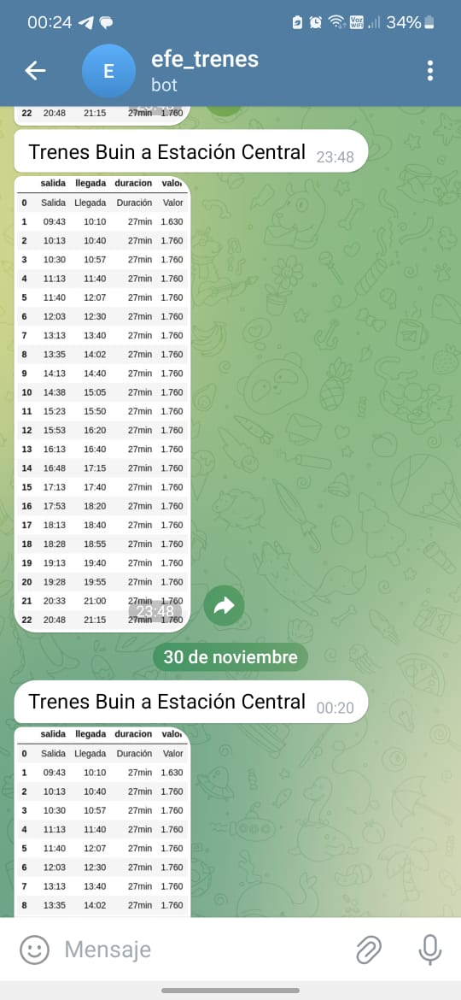

# Chilean Train Telegram Bot Scraper
A bot that scrapes the [www.efe.cl](https://www.efe.cl) website to fetch the next day's train schedules and sends them directly to your personal Telegram bot.

## How It Works
The script in `main.py` allows you to specify the **origin** and **destination** stations to retrieve train schedules. 

### Available Stations
You can choose from the following stations:

- **Estación Central**
- **San Bernardo**
- **BuinZoo**
- **Buin**
- **Linderos**
- **Paine**
- **Hospital**
- **San Francisco**
- **Graneros**
- **Rancagua**

### Default Configuration
By default, the script is set up to retrieve the schedules for:
- **Buin → Estación Central**
- **Estación Central → Buin**

This configuration fetches train schedules for the next day.

### Setting Origin and Destination
In the `main.py` file, you can customize the origin (`origen`) and destination (`destino`) variables to the desired stations, e.g.:

```python
origen = "Buin"
destino = "Estación Central"


